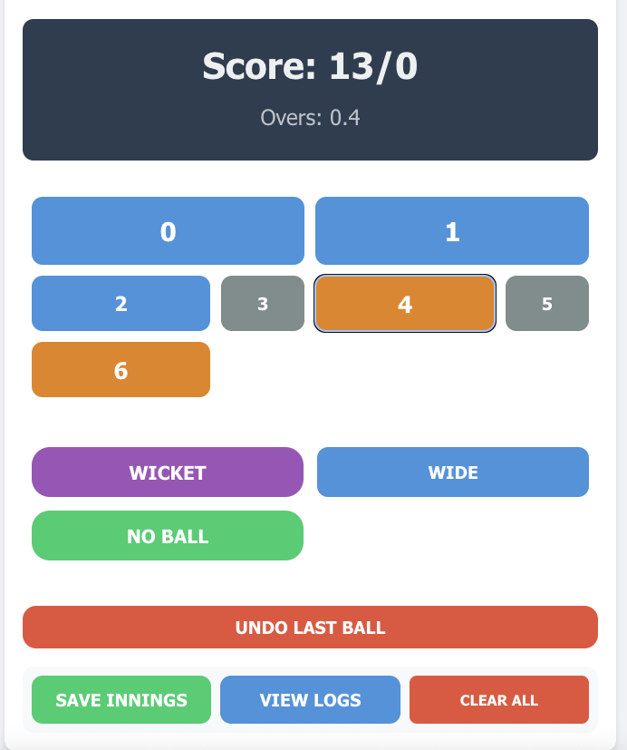

# Cricket Game Tracker

A real-time cricket scoring application built with React and TypeScript. Keep track of cricket matches with an intuitive interface for scoring runs, wickets, extras, and maintaining ball-by-ball history.



## Features

- **Real-time Scoring**

  - Track runs, wickets, and overs
  - Ball-by-ball history with horizontal scroll
  - Support for extras (Wide, No Ball)
  - Undo last ball functionality

- **Run Controls**
  - Quick buttons for 0-6 runs
  - Larger buttons for commonly used runs (0,1)
  - Special highlighting for boundary runs (4,6)
  - Smaller buttons for less common runs (3,5)


- **Special Deliveries**

  - Wide ball tracking
  - No ball with additional runs
  - Wicket recording

- **Innings Management**
  - Save multiple innings with team names
  - View innings history
  - Delete individual innings records
  - Clear all data option


- **Data Persistence**
  - Automatic saving to localStorage
  - Survives page reloads
  - Complete match history preservation

## Technologies Used

- React
- TypeScript
- CSS3
- Local Storage API
- Vite

## Installation

1. Clone the repository:

```bash
git clone https://github.com/yourusername/cricket-game-tracker.git
```

2. Navigate to the project directory:

```bash
cd cricket-game-tracker
```

3. Install dependencies:

```bash
npm install
```

4. Start the development server:

```bash
npm run dev
```

5. Open [http://localhost:5173](http://localhost:5173) to view it in your browser.

## Usage

1. **Basic Scoring**

   - Click number buttons (0-6) for runs
   - Use "Wide" or "No Ball" for extras
   - Click "Wicket" for fall of wicket

2. **Managing Innings**

   - Click "Save Innings" to store current score
   - Enter team name when prompted
   - View saved innings in logs
   - Delete individual innings as needed

3. **Ball History**
   - View ball-by-ball history at the top
   - Scroll horizontally for full history
   - Green highlights for No Balls

## Contributing

Pull requests are welcome. For major changes, please open an issue first to discuss what you would like to change.

## License

[MIT](https://choosealicense.com/licenses/mit/)
